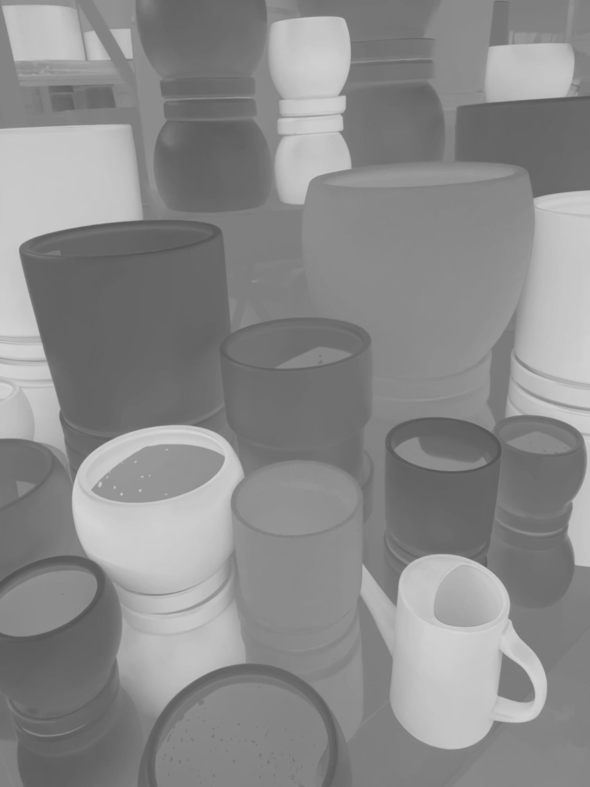
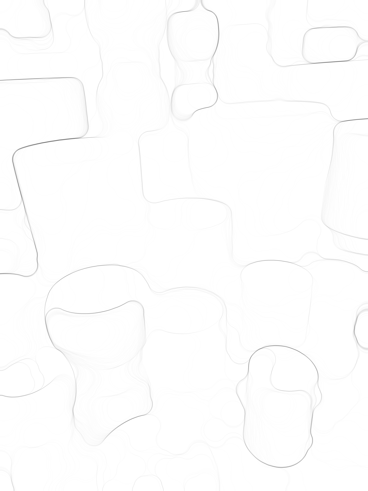
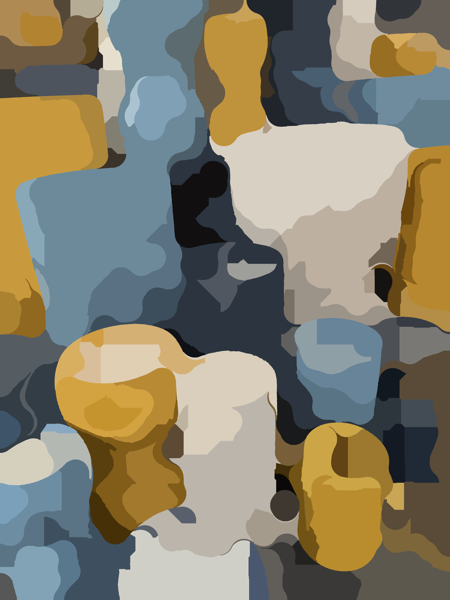
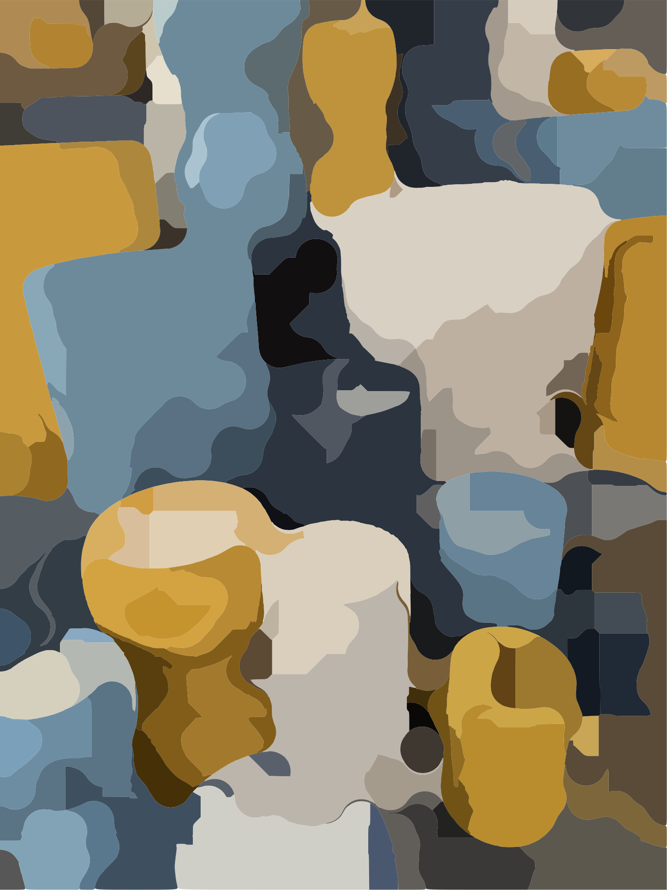

# ImageArt

[](https://opensource.org/licenses/MIT)

## Description

ImageArt is a work-in-progress command-line tool designed for artists who want to transform digital photographs into visually interesting works of art. Although there are reasonable defaults that may do something interesting with your photos, in practice you should spend some time getting to know the input parameters and iteratively adjusting them to get the effect you want for your images.  There is no right way to do this, it is art.

## Key Features

- **Abstract Art Generation:** ImageArt primarily transforms shapes from the original image into uniform-colored and smoothed shapes.  Sometimes, this is all you want.  Other times, this is the starting point for you to figure out what you want to do to create something new.

- **Output Formats:** Raster images are output in PNG format, and polygon versions in SVG format (allowing you to create resolution-independent works).

- **Painted-Look Rendering:** Turn your abstract shapes into painted masterpieces. ImageArt adds a paint style to the generated shapes in a separate file.  This is the first of several finishing effects that are planned.

- **Your Vision:** Use ImageArt to experiment and create visually interesting art from photographs. While not all photographs are suitable, those with large, interesting shapes of similar colors or structural patterns work well.

- **Cross-Platform Compatibility:** ImageArt is designed to be portable.  It works as-is with Visual Studio targetting Windows.  Earlier versions compiled and ran fine on Linux, but the current version will need some minor fixes to compile and run on Linux.

## License

This project is licensed under the MIT License - see the [LICENSE.md](LICENSE.md) file for details.

The only third-party code used in this project are the public domain STB single-file headers for reading in and writing out JPEG and PNG formats.

## Usage Instructions

This is a command line application.  You pass various pairs of tags and values to it in order to tell it what to do.  To create images using ImageArt on a Windows system:

1. Open your Windows Command Prompt.

2. Type a command in this form to run ImageArt (replace `Imageart.exe` with the appropriate executable name for your platform):

Imageart.exe tag1=value1 tag2=value2 ...

3. Specify the input image using the `filename` tag in the Windows path convention:

filename="C:\path\to\your\image.jpg"

4. Customize your artwork using additional tags and values, as needed. For example:

- `xdiv` and `ydiv`: Set the starting grid size for finding shapes (defaults to 100 for each).
- `w`, `pre_window`, or `windowsize`: Adjust the size of the preprocessing window to diminish the effect of small image features.
- `erode` and `dilate`: Set to "0" to use a square structuring element for erosion or dilation, or "1" for a disc-shaped structuring element.
- `colormatch`: Control the color difference threshold (default is 17) for merging neighboring regions.
- `poly`: Set to "0" for no polygon representation in SVG, and "1" for generating polygon representations.
- `fine`: Set to "0" for a polygon representation that doesn't follow pixel contours, and "1" for precise contour following.
- `background`: Set to "0" for a white background during painting, and "1" for a black background.
- `post_erode` and `post_dilate`: Control the structuring element shape for post-processing (square or disc).
- `p`: Set the size of the post-processing structuring element.
- `gap`: If provided, reduces the dilation size in post-processing, spacing shapes apart (twice the gap size).
- `c`: Specify a single color channel (1=red, 2=green, 3=blue) for grayscale conversion.
- `nc`: Specify a negative color channel when using `c` to calculate grayscale and gradients.
- `repeat`: Adjust the repeat value (default is 2) to control the number of passes through the main detecting stage. Higher values may generate more small shapes.

5. Specify the output directory using the `path` tag (if different from the default "d:\temp"):

path="C:\path\to\output\files"

6. The main output is a file named "output.png," which contains the transformed artwork. If `poly` is set, an additional "output.svg" file with polygon representations is generated. If `poly` is used along with post-processing (e.g., with the "p" flag), "output_post.svg" is also created. "output_paint.png" contains the version of the output with painted effects.

##Examples

Here is an example using this image:


The command to process it is:

```
.\Image_Art.exe filename="Planters.png" xdiv=185 ydiv=185 c=1 nc=3 erode=1 dilate=1 w=185 fine=1 poly=1 colormatch=25
```

The command will take a little while to run, while outputting various information to the command window (see the source code for what this all means).  Along the way, it will generate several files.  Among them are:



This is the grayscaled image using the difference between the red and blue color channels.



This is the gradient image generated from the grayscale, using the 185 pixel disc structuring elements for morphological opening followed by closing (erosion, two dilations, and another erosion).



This is one of the main outputs, and is a raster image of the same size as the input image.  While interesting, it shows a lot of pixelation.



This is a line-art SVG version of the earlier output, which may be more useful for further work, as it is resolution independent.


This is an output used for diagnostics.  It breaks each shape down to a one pixel wide skeleton.


This is another raster output image, which shows the paint style effect.  This version has been downsized, because the original was a bit large.


