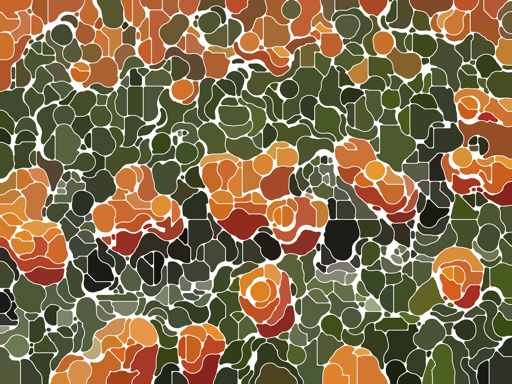
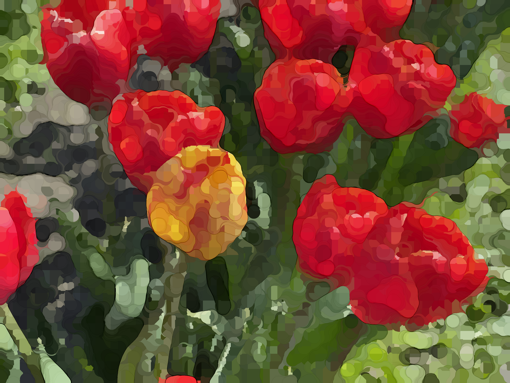
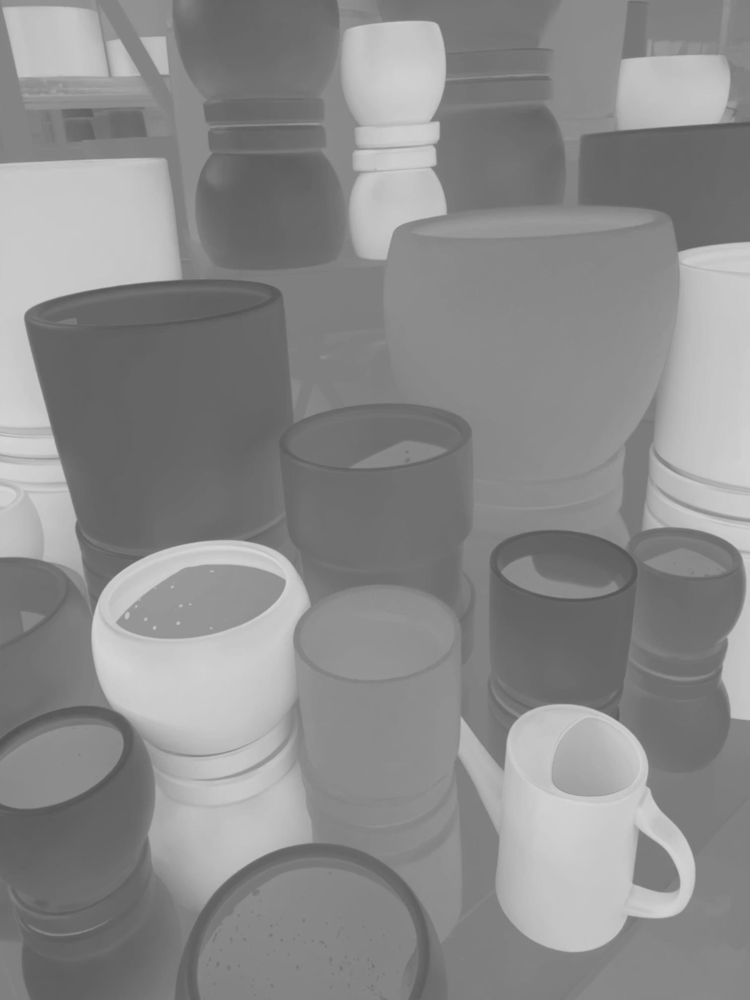
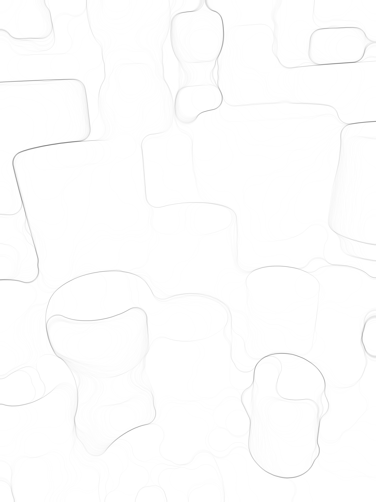
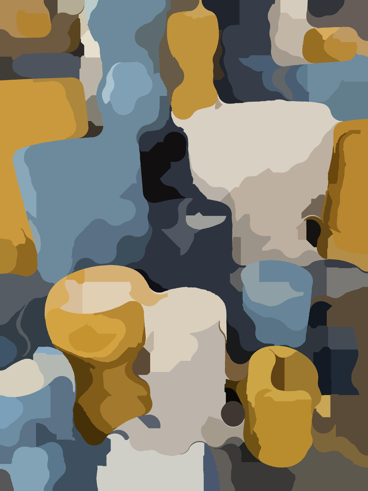
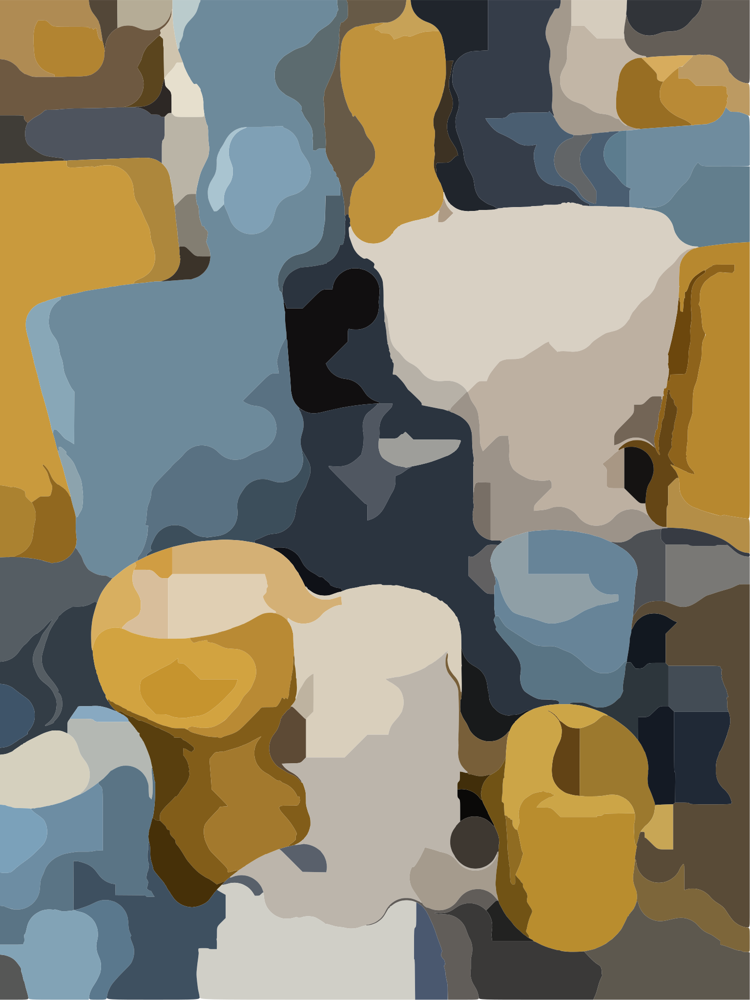
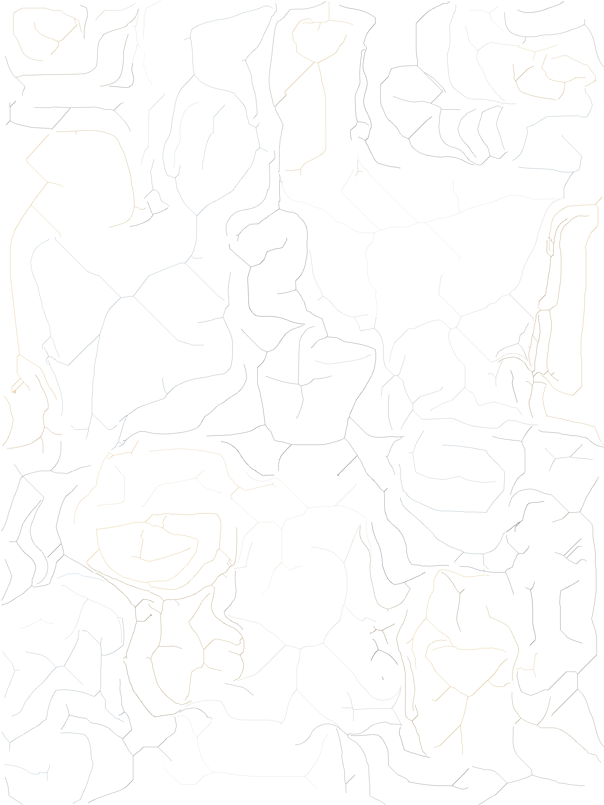

# ImageArt

[](https://opensource.org/licenses/MIT)

## Description

ImageArt is a work-in-progress command-line tool designed for artists who want to transform digital photographs into visually interesting works of art.  Although there are reasonable defaults that may do something interesting with your photos, in practice you should spend some time getting to know the input parameters and iteratively adjusting them to get the effect you want for your images.  There is no right way to do this, it is art.

There are now two variants of the tool included.  One uses only CPU resources to do all the work, and it is called Image_Art.exe.  Another uses an NVIDIA GPU to do many of the calculations, and it produces results much more quickly.  It is called Cuda_Image_Art.exe.  The GPU version includes the work I have been doing to simulate something like watercolor painting effects.  The process it uses is too time-intensive to run on the CPU alone (even using AVX2 CPU instructions to speed it up).

Since the world has changed a lot in the last three years I have been working on this, I feel like I need to explain that this is not AI.  The processes by which this software creates images does not use neural networks or any other AI technology.  It is based on image-processing algorithms, and has all been hand coded by me (and maybe soon one of my kids, if I can get them interested).

## Key Features

- **Abstract Art Creation:** ImageArt primarily transforms shapes from an original image (such as a photograph) into uniform-colored and smoothed shapes.  Sometimes, this is all you want.  An example of that is this image of tulips (which was recently selected by my city to be included on wraps around utility boxes):

Other times, this is just the starting point for you to figure out what you want to do to create something new.  For example, here is an image I made by combining the base color shapes with the gradient file output for the same image, to give more definition to some of the edges:


- **Output Formats:** Raster images are output in PNG format, and polygon versions in SVG format (allowing you to create resolution-independent works).

- **Painted-Look Rendering:** You can turn your abstract shapes into works that have a painted-type effect.  There are currently two versions of this effect.  The main one, which I have had working longer, simulates opaque paint applied with a brush:

The more watercolor-like effect is available only in the version that runs on your GPU.  Here is an example of that:

Other finishing effects are planned.

- **Flexibility:** Use ImageArt to experiment and create visually interesting art from photographs. While not all photographs are suitable, those with large, interesting shapes of similar colors or structural patterns work well.  Playing with the settings, and sometimes trying extreme settings, often results in striking results.  Here is a highly stylized image I created from a photograph of jellyfish:


- **Cross-Platform Compatibility:** ImageArt works as-is with Visual Studio targeting Windows.  Earlier versions compiled and ran fine on Linux, but the current version will need some minor fixes to compile and run on Linux.  I am planning to get this working on Linux again soon.

## License

This project is licensed under the MIT License - see the [LICENSE.md](LICENSE.md) file for details.

The only third-party code used in this project are the public domain STB single-file headers for reading in and writing out JPEG and PNG formats.

## Building the project

The project is built with Visual Studio 2022 on Windows.  Open `Image_Art.sln` and build either `Image_Art` or `Cuda_Image_Art`, depending on which executable you want to use.

`Image_Art` is the CPU version.  It uses the Visual Studio `17.14.31 (April 2026)` toolset, the Windows 10 SDK, and C++20 for the x64 configurations.  The x64 build also enables AVX2 instructions.

`Cuda_Image_Art` is the GPU version.  It builds only for x64 and uses the Visual Studio `17.14.31 (April 2026)` toolset, C++17, and CUDA 13.3.  A compatible NVIDIA GPU and CUDA Toolkit installation are required for this project.

There are a few local paths in the project files that may need to be changed for another setup.  `Image_Art.cpp` sets the default output directory to `D:\temp\`, although this can be overridden when running the program with the `path` tag.  Also in `Image_Art.cpp` is a named test file, which is `SNC00015.jpg`.  This is a file I use for testing, and the value should be replaced with something you have on hand.  It is only used if no `filename` tag is used when running the program.

I find that keeping a directory outside of the actual project directory for running and testing the program is useful.  So, the Visual Studio project files also include post-build commands that copy the built executables into the local directory that I use for this: `D:\VS Projects\Image_Art_Extra\`.  These copy commands can be edited or removed if that directory does not exist.  The `Image_Art.vcxproj.user` file contains debugger arguments with local image and output paths; those only affect debugging from Visual Studio.

## Usage Instructions

This is a command line application.  You pass various pairs of tags and values to it in order to tell it what to do.  To create images using ImageArt on a Windows system:

1. Open your Windows Command Prompt.

2. Type a command in this form to run ImageArt (replace `Imageart.exe` with the appropriate executable name for your platform):

	`Imageart.exe tag1=value1 tag2=value2 ...`

3. Specify the input image using the `filename` tag in the Windows path convention:

	`filename="C:\path\to\your\image.jpg"`

4. Customize your artwork using additional tags and values, as needed. The available tags are listed below.

5. Specify the output directory using the `path` tag (if different from the default "d:\temp"):

	`path="C:\path\to\output\files"`

6. The main output is a file named "output.png," which contains the transformed artwork. If `poly` is set, an additional "output.svg" file with polygon representations is generated. If `poly` is used along with post-processing (e.g., with the "p" flag), "output_post.svg" is also created. "output_paint.png" contains the version of the output with painted effects.

## Tag reference

Tags can be passed as `tag=value`, `tag =value`, or `tag value`. Some tags are binary settings that take `0` or `1`. Other tags are numerical parameters, filenames, or directory paths. The defaults below are the values currently set in the source code.

### Input and output

- `filename`, `f`: Input image filename.  The current source code sets a test default of `SNC00015.jpg`; normal use should pass this tag explicitly.
- `path`: Output directory.  The current default is `D:\temp\`.  A trailing backslash is added if needed.
- `file_output`, `fo`, `output`: Selects which files to write.  The value is the sum of the output options for a run.  The default is `255`, which enables all currently defined output bits.  Use `1` for gray, edge, skeleton, and paint path diagnostics; `2` for the base PNG; `4` for the base SVG; `8` for the post-processed PNG; `16` for the post-processed SVG; `32` for the painted PNG; and `64` for progressive paint.  For example, `16` writes only the post-processed SVG, while `20` writes both the base PNG and the post-processed SVG.  Progressive paint is not currently supported by the CUDA version.
- `inpath`: Directory used to locate existing intermediate files.  If `spfile`, `grayfile`, or `edgefile` are not set, this directory is used with `SuperPixels.dat`, `output_gray.png`, and `output_edge.png`.
- `spfile`: Reads superpixel data from a file instead of starting from the original image.
- `grayfile`: Sets the grayscale input file used with `inpath`.
- `edgefile`: Sets the edge input file used with `inpath`.

### Shape detection

- `xdiv`, `x`: Starting grid width for the watershed stage.  The default is `100`.
- `ydiv`, `y`: Starting grid height for the watershed stage.  The default is `100`.
- `repeat`, `refine`, `r`: Number of watershed passes.  The default is `2`.  Additional passes split existing regions and run the watershed calculation again.
- `colormatch`: Color difference threshold used when merging neighboring regions.  The default is `17`.
- `channel`, `c`: Color channel used for grayscale conversion.  The default is `0`, which uses an ordinary grayscale image to find brightness gradients.  Values `1`, `2`, and `3` use only the red, green, or blue channel.
- `nchannel`, `negchannel`, `nc`: Negative color channel used with `channel` when calculating grayscale and gradients.  The default is `0`.  When this is used with `channel`, image brightness is based on the difference between the two channels.  For example, `channel=1 nchannel=2` uses the difference between red and green, which can make a red object stand out against green surroundings.
- `pre_window`, `windowsize`, `w`: Preprocessing window size.  This controls the size of the morphological smoothing window used before edge detection.  The default is `3`.
- `erode`, `preerode`, `pre_erode`, `pre-erode`: Preprocessing erosion shape.  Use `0` for a square structuring element and `1` for a circle.  The default is `1`.
- `dilate`, `predilate`, `pre_dilate`, `pre-dilate`: Preprocessing dilation shape.  Use `0` for a square structuring element and `1` for a circle.  The default is `1`.
- `grad`, `gradthickness`, `grad_thickness`: Gradient thickness.  The default is `3`, and values below `3` are raised to `3`.
- `close_first`, `reverse`: Binary.  Reverses the normal preprocessing order.  By default, smoothing first uses an opening transformation, where small connections between areas may be lost, followed by a closing transformation, where nearby objects may form a connection.  Setting this to `1` does the closing step before the opening step.  The default is `0`.
- `snap`, `k`: Adds semi-permeable barriers around the edges of each starting cell, where each cell is one `xdiv` by `ydiv` region of the image.  Higher values make superpixels less likely to extend across those cell boundaries, which can create a boxier result.  The default is `0`, which has no effect.  A value near `5` is pronounced, and a value near `20` makes cross-cell growth rare.

### Post-processing and SVG output

- `post_window`, `p`: Post-processing window size.  The default is `0`, which disables post-processing.
- `gap`, `g`: Reduces the dilation size during post-processing.  The default is `0`.  If `post_window - gap` is less than `3`, both values are reset to `0`.
- `post_erode`, `posterode`, `post-erode`: Post-processing erosion shape.  Use `0` for a square structuring element and `1` for a circle.  The default is `1`.
- `post_dilate`, `postdilate`, `post-dilate`: Post-processing dilation shape.  Use `0` for a square structuring element and `1` for a circle.  The default is `1`.
- `polygon`, `poly`: Binary. Enables polygon output in SVG files.  The default is `1`.
- `fine`: Binary. Uses more precise contour following for SVG output.  The default is `0`.
- `palette`, `pal`: Limits the output image to the specified number of colors.  The default is `0`, which leaves palette reduction disabled.  This is useful when the output will be reproduced with a limited palette.
- `early_palette`, `ep`: Binary.  Applies palette selection as soon as shape information is available.  If this is not enabled, palette selection happens later, after post-processing may have changed the number and size of objects.  The default is `0`.
- `contrast`: Radius, in pixels, used to adjust SVG colors near object edges for slightly higher contrast with nearby objects.  The default is `0`, which disables this adjustment.  Values above `0` require a raster image to be embedded in the SVG, so the result is not entirely resolution-independent.

### Diagnostic modes and seeds

- `show_grays`, `grays`: Binary.  Writes grayscale diagnostic files and exits after that mode.  These files show the result of using different combinations of `channel` and `nchannel`.  The default is `0`.
- `show_edges`, `edges`: Binary.  Writes gradient diagnostic files which show detected edges and exits after that mode.  These files show a series of possible `w` values leading up to the one provided.  The default is `0`.
- `seeds_out`, `so`: Binary.  Writes `seeds.txt` to the output directory.  The default is `0`.
- `seeds_in`, `si`: Reads seed positions from a file in the output directory.  There is no default file.

### Painting

- `background`, `b`: Painting background color.  The default is `0`, which means white.  A value of `1` means black.
- `paint_scale`, `scale`: Scale factor for painted output.  The default is `1`.
- `bristles`, `num_bristles`: Bristle coefficient used to set the number of bristles in a brush.  The default is `80`.
- `brush_width`, `bw`: Brush width used when `width_override` is enabled.  The default is `30`.
- `width_override`, `wo`: Binary. Uses `brush_width` directly instead of deriving brush width from region size.  The default is `0`.
- `thin`, `bristle_thin`, `thinness`: Controls how quickly bristle strength falls off in the bristle kernel.  The default is `2.0`.
- `flow`: Paint flow.  The default is `20.0`.  Values less than or equal to `0` are raised to `1.0`, and values above `100` are capped at `100`.
- `flow_variation`, `fv`: Variation added to paint flow.  The default is `10.0`.  It is clamped so that `flow + flow_variation` does not exceed `100`.
- `radius_variation`, `rv`: Binary.  Enables variation in brush width (radius).  The default is `1`.
- `subpixel`, `sub_pixel`, `sp`: Binary.  Uses sub-pixel bristle positioning.  The default is `0`.
- `paint_mask`, `mask`, `pm`: Binary.  Restricts painting to the current region mask.  The default is `1`.
- `mix_paints`, `mix`: Binary.  Uses the previous paint color as the secondary brush color.  The default is `1`.
- `outline`, `outlines`, `o`: Binary.  Adds black outline painting.  The default is `0`.
- `glitch`: Sets `glitch1`, `glitch2`, and `glitch3` as bit flags.  Bit `1` sets `glitch1`, bit `2` sets `glitch2`, and bit `4` sets `glitch3`.
- `glitch1`: Binary.  Enables an older glitchy painting behavior that may be useful for experimentation.  The default is `0`.
- `glitch2`: Binary.  Enables an older glitchy painting behavior that may be useful for experimentation.  The default is `0`.
- `glitch3`: Binary.  Enables an older glitchy painting or path behavior that may be useful for experimentation.  The default is `0`.

## Example

Here is an example using this image:


The command to process it is:

```
.\Image_Art.exe filename="Planters.png" xdiv=185 ydiv=185 c=1 nc=3 erode=1 dilate=1 w=185 fine=1 poly=1 colormatch=25
```

The command will take a little while to run, while outputting various information to the command window (see the source code for what this all means).  Along the way, it will generate several files.  Among them are:



Above is the grayscaled image using the difference between the red and blue color channels.



Above is the gradient image generated from the grayscale, using the 185 pixel disc structuring elements for morphological opening followed by closing (erosion, two dilations, and another erosion).



Above is one of the main outputs, and is a raster image of the same size as the input image.  While interesting, it shows a lot of pixelation.



Above is a line-art SVG version of the earlier output, which may be more useful for further work, as it is resolution independent.



Above is an output used for diagnostics.  It breaks each shape down to a one pixel wide skeleton.


Above is another raster output image, which shows the paint style effect.  This version has been downsized, because the original was a bit large.


